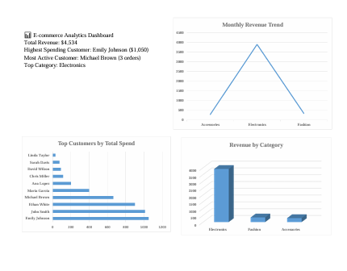

## 📊 Dashboard Preview

A visual dashboard was created in Excel to summarize insights clearly:



---

## 📄 Full Report (Download PDF)

Click below to access the complete analysis report:

👉 [**Download Report (PDF)**](reports/Nomoz_Ecommerce_Analytics_Report.pdf)

The report includes:
- SQL queries & outputs
- Revenue analysis
- Customer spend breakdown
- Excel dashboard visualization
- Business insights & conclusion

---

## 🔧 How to Run This Project

1. Clone the repository  
   ```bash
   git clone https://github.com/Elementexperts/ecommerce-sql-analysis.git

---

# 📊 E-commerce Sales Analysis (SQL Project)

This project analyzes e-commerce sales data using **SQL (SQLite + DBeaver)** to extract insights about revenue, customer behavior, and sales performance.  
It is part of my Data Analytics portfolio and demonstrates SQL skills applied to real business scenarios.

---

## 🔍 Project Goals

- Build & query a relational database using SQL
- Analyze customer spending behavior
- Identify top revenue-generating categories
- Discover highest-value and most active customers
- Prepare dashboard-ready analytical outputs

---

## 🗂 Dataset Overview

**Customers Table (`customers`)**

| Column | Description |
|---|---|
| customer_id | Unique customer identifier |
| name | Customer full name |
| age | Age of customer |
| city | Customer location |
| signup_date | Registration date |

**Orders Table (`orders`)**

| Column | Description |
|---|---|
| order_id | Unique order identifier |
| customer_id | Linked to customers table |
| order_date | Date of purchase |
| product | Item name |
| category | Product category |
| price | Sale price |
| quantity | Number of units purchased |

---

## 🧠 Key Insights

| Metric | Result |
|---|---|
| **Total Revenue** | **$4,534** |
| **Top Spender** | **Emily Johnson ($1,050)** |
| **Most Active Customer** | **Michael Brown (3 orders)** |
| **Highest Revenue Category** | **Electronics** |
| **Analyzed Time Period** | June 2023 |

> Electronics dominated revenue, driven mainly by high-ticket items like laptops, tablets, and phones.  
> Customer engagement is strong, with several repeat buyers — showing retention potential.

---

## 📌 SQL Queries Used

```sql
-- 1) Total Revenue
SELECT SUM(price * quantity) AS total_revenue
FROM orders;

-- 2) Revenue by Category
SELECT category, SUM(price * quantity) AS revenue
FROM orders
GROUP BY category
ORDER BY revenue DESC;

-- 3) Top Customers by Spend
SELECT c.name, SUM(o.price * o.quantity) AS total_spent
FROM customers c
JOIN orders o ON c.customer_id = o.customer_id
GROUP BY c.name
ORDER BY total_spent DESC;

-- 4) Order Frequency by Customer
SELECT c.name, COUNT(o.order_id) AS total_orders
FROM customers c
JOIN orders o ON c.customer_id = o.customer_id
GROUP BY c.name
ORDER BY total_orders DESC;

-- 5) Monthly Revenue Trend
SELECT strftime('%Y-%m', order_date) AS month,
       SUM(price * quantity) AS revenue
FROM orders
GROUP BY month
ORDER BY month;
